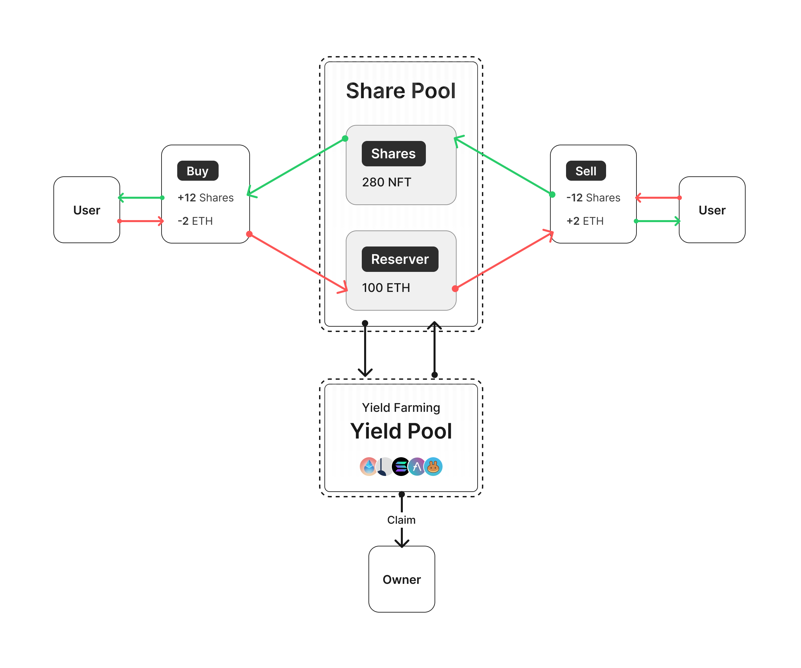

<pre align="center">
  
  <br/>
  <em>Mest is a payment protocol for everyone.</em>
  <em>Buy something via the bonding curve and yield farming.</em>
</pre>

##

Mest Protocol provides a new way to pay where you can stake ETH by a unique S-shaped bonding curve and yield farming, buy what you need, and withdraw whenever you want.  

* 🐦 For users, pay early and save more
* 💵 For you, long-term revenue from fees and yield
* ⚡ Lightweight, S-curve, and flexible yield strategies
* 🌟 Made for early-stage startups and KOLs.

<div align="center">
<br/>

| Features                       | Mest  | Friendtech | Coinbase Commerce |
|--------------------------------|-------|------------|-------------------|
| User Capacity                  | 100K  | <= 100     | N/A               |
| Capital efficiency             | ✅    | ❌          | ❌                |
| Permissionless                 | ✅    | ✅          | ❌                |
| Tokenization                   | ✅    | ❌          | ❌                |

<br/>
</div>

## How Mest works？

<div align="center">
  
</div>

Mest Protocol utilizes an S-shaped bonding curve, blending a quadratic and a square root function for dynamic pricing. When you buy, it mints tokens and drives prices up; when you sell, it burns tokens and lowers prices. Staked ETH is allocated in an interest-rate market to generate sustainable rewards, which are then redistributed to creators.

## Contracts

<div align="center">
  
</div>

### ERC1155

The token is a standard `ERC1155` contract, with NFTs serving as shares in the bonding curve. When you trade shares, NFTs are minted or burned.

### SharesFactory

SharesFactory is the core contract that contains the bonding curve and yield aggregator logic where you can mint, buy, and sell shares, as well as change yield strategies and claim yields.

### YieldAggregator 

YieldAggregator is a yield strategy contract that provides a common interface for `SharesFactory` to use, such as deposit, withdraw, and claimable. However, the underlying logic can be any yield strategy, such as Aave, Pendle and LRT, or even nothing.

## Deployment And Test

We use foundry and hardhat to build tests and deploy.

### Commands

```bash
Scripts available via `npm run-script`:
  compile
    npx hardhat compile
  deploy
    npx hardhat run scripts/deploy.ts
  verify
    npx hardhat verify
```

```bash
Foundry Commands
  unit tests
    forge test --fork-url [ARB-RPC]
  coverage
    forge coverage --fork-url [ARB-RPC]
```

## Acknowledgement

