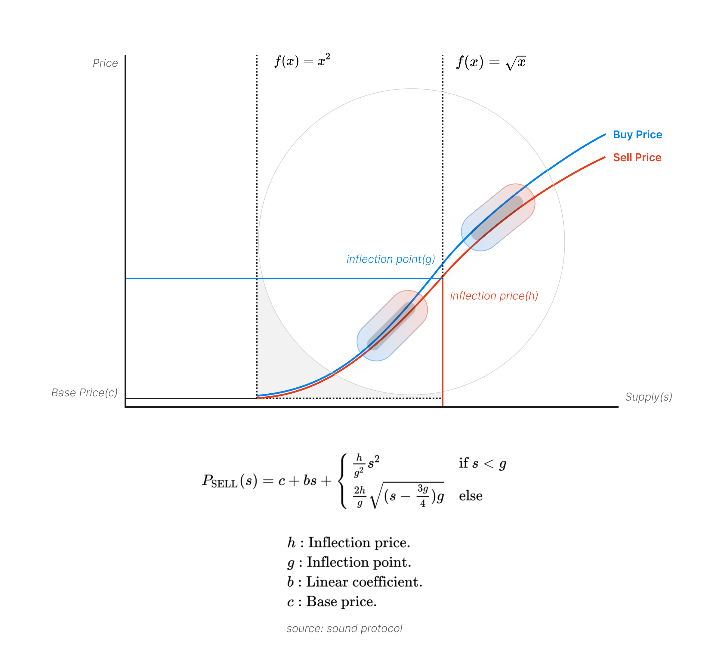

<pre align="center">
  <em></em>
  
  <em></em>
  <em>A NEW WAY TO PAY.</em>
  <em>Payment via the bonding curve and yield farming.</em>
  <em></em>
</pre>

The contract provides a new way to pay where you can stake ETH by a unique S-shaped bonding curve and yield farming, buy what you need, and withdraw whenever you want.  

* 🐦 For users, pay early and save more
* 💵 For you, long-term revenue from fees and yield
* ⚡ Lightweight, S-curve, and flexible yield strategies
* 🌟 Made for early-stage startups and KOLs.

<div align="center">
<br/>

| Features                       | Mest  | Friendtech | Coinbase Commerce |
|--------------------------------|-------|------------|-------------------|
| User Capacity                  | 100K  | <= 100     | N/A               |
| Capital efficiency             | ✅    | ❌          | ❌                |
| Permissionless                 | ✅    | ✅          | ❌                |
| Tokenization                   | ✅    | ❌          | ❌                |

<br/>
</div>

## How it works？

The contract utilizes an S-shaped bonding curve, blending a quadratic and a square root function for dynamic pricing. When you buy, it mints tokens and drives prices up; when you sell, it burns tokens and lowers prices. And the staked ETH is allocated in an interest-rate market to generate sustainable rewards, which are then redistributed to shares owner.

<div align="center">
  
</div>

## Contracts

### NFT

The token is a standard ERC1155 contract, with NFTs serving as shares in the bonding curve. When you trade shares, NFTs are minted or burned.

### Shares

SharesFactory is the core contract that contains the bonding curve and yield aggregator logic where you can mint, buy, and sell shares, as well as change yield strategies and claim yields.

### Yield 

YieldAggregator is a yield strategy contract that provides a common interface for SharesFactory to use, such as deposit, withdraw, and claimable. However, the underlying logic can be any yield strategy, such as Aave, Pendle and LRT, or even nothing.

## Test And Depoly

We use foundry and hardhat to build tests and deploy.

```bash
  unit tests
    forge test --fork-url [ARB-RPC]
  coverage
    forge coverage --fork-url [ARB-RPC]
  compile
    npx hardhat compile
  deploy
    npx hardhat run scripts/deploy.ts
  verify
    npx hardhat verify
```

## Acknowledgement

Thanks to [Simon de la Rouviere](https://docs.google.com/document/d/1VNkBjjGhcZUV9CyC0ccWYbqeOoVKT2maqX0rK3yXB20), whose ideas inspired Mest to combine curated market with bonding curves, and to the ideal S-curve model from [sound protocol](https://github.com/soundxyz/sound-protocol), we’ve also learned the principle of minimalism from [friend tech](https://www.friend.tech) and [bodhi](https://bodhi.wtf).
