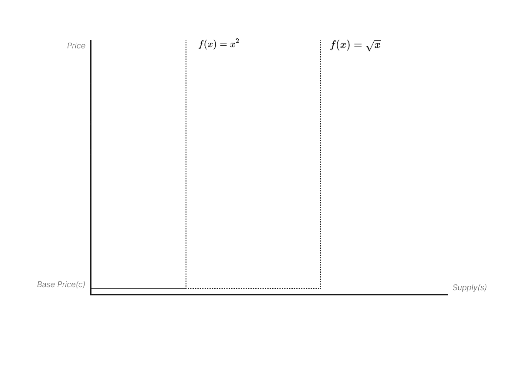

<pre align="center">
  <em></em>
  
  <em></em>
  <em>A NEW WAY TO PAY.</em>
  <em>Payment via the bonding curve and yield farming.</em>
  <em></em>
</pre>

Mest, a payment protocol designed for creators. And it's a bridge between creators and fans, where fans can donate, sponsor, subscribe, etc. The contract provides a new way to pay where you can stake ETH by a sigmoid bonding curve and yield farming, buy what you need, and withdraw whenever you want.

-   🐦 For fans, pay early and save more
-   💵 For creators, long-term income from fees and yield
-   ⚡ Lightweight with flexible curve and yield strategies
-   🌟 Made for creators like startups, indie hackers and KOLs.

<div align="center">
<br/>

| Features           | Mest  | FriendtechV1 | Patreon | Coinbase Commerce |
| ------------------ | ----- | ------------ | ------- | ----------------- |
| User Capacity      | > 10K | < 100        |         | N/A               |
| Capital efficiency | ✅    | ❌           | ❌      | ❌                |
| Permissionless     | ✅    | ✅           | ❌      | ❌                |
| Tokenization       | ✅    | ❌           | ❌      | ❌                |

<br/>
</div>

## How it works？

The contract uses a sigmoid bonding curve for dynamic pricing. When you buy, it mints tokens and drives prices up, then when you sell, it burns tokens and drives prices down. The staked ETH is allocated in an interest-rate market to generate sustainable rewards, which are then redistributed to the creators.

<div align="center">
  
</div>

## Contracts

### NFT

The token is a standard ERC1155 contract, with NFTs acting as shares in the bonding curve. When you trade shares, NFTs are minted or burned.

### Shares

SharesFactory is the core contract that contains the bonding curve and yield aggregator logic where you can mint, buy, and sell shares, as well as change yield strategies and claim yields.

### Yield

YieldAggregator is a yield strategy contract that provides a common interface for SharesFactory to use, such as deposit, withdraw, and claimable. However, the underlying logic can be any yield strategy, such as Aave, Pendle and LRT, or nothing at all.

## Test and Deploy

We use foundry to build tests and deploy.

```bash
install
  yarn install
test
  yarn run test
coverage
  yarn run coverage
deploy
  yarn run deploy:testnet
  yarn run deploy:mainnet
```

## Acknowledgement

Thanks to [Simon de la Rouviere](https://docs.google.com/document/d/1VNkBjjGhcZUV9CyC0ccWYbqeOoVKT2maqX0rK3yXB20), whose ideas inspired Mest to combine curated market with bonding curves, and to the ideal S-curve model from [sound protocol](https://github.com/soundxyz/sound-protocol), we’ve also learned the principle of minimalism from [friend tech](https://www.friend.tech) and [bodhi](https://bodhi.wtf).
